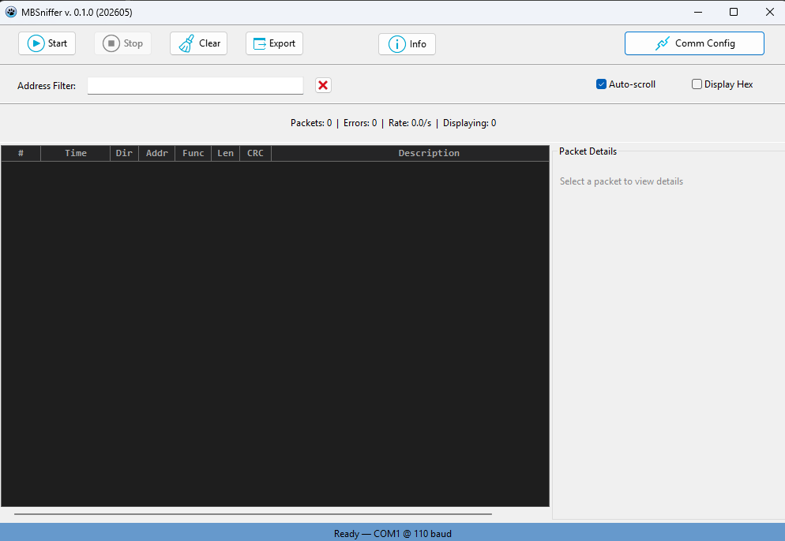

# Modbus RTU Sniffer (MBSniffer)

**DISCLAIMER: Documentation, including this readme, 
generated using Antropic's Claude Opus 4.8**

A lightweight, single-window **passive Modbus RTU bus 
monitor**, written in **Free Pascal / Lazarus (LCL)**. 
It listens on an RS‑232/RS‑485 serial line, reassembles 
complete Modbus RTU frames, classifies each one as a 
master request (TX) or slave response (RX), decodes it, 
and displays it live with full protocol details.

Unlike a Modbus master, MBSniffer **never transmits**. 
It taps an existing bus and reconstructs the traffic 
that is already flowing — making it a diagnostic and 
reverse‑engineering tool rather than a device you poll 
with.


## Features

- **Passive capture** — never sends a byte; safe to 
attach to a live bus
- **Automatic frame assembly** — reconstructs frames 
from a raw byte stream using CRC‑16 as the boundary 
detector (Modbus RTU has no start‑of‑frame marker)
- **TX/RX direction detection** — a four‑rule heuristic 
(pending‑request matching, inter‑packet timing, idle‑gap 
analysis, and structural patterns) classifies each frame 
without needing separate hardware lines for each 
direction
- **All common function codes decoded**
  - `01` Read Coils
  - `02` Read Discrete Inputs
  - `03` Read Holding Registers
  - `04` Read Input Registers
  - `05` Write Single Coil
  - `06` Write Single Register
  - `15` (0x0F) Write Multiple Coils
  - `16` (0x10) Write Multiple Registers
  - `23` (0x17) Read/Write Multiple Registers
- **Exception decoding** — the high‑bit (0x80) exception 
responses are flagged and the exception code is resolved 
to a human‑readable reason
- **CRC‑16 validation** — every frame is checked against 
the Modbus reflected‑0xA001 CRC; bad frames are 
highlighted rather than dropped
- **Color‑coded capture grid** — blue for TX, green for 
RX, red for exceptions, magenta for bad‑CRC frames
- **Packet detail panel** — click any row for a full 
breakdown: header fields, full hex, raw bytes, isolated 
payload bytes, and the parsed description
- **Live filter** — filter by address, function code, 
direction, description, timestamp, or raw hex, plus 
keyword shortcuts (`tx`, `rx`, `read`, `write`, `error`)
- **Live statistics** — packet count, error count, 
capture rate, and displayed‑row count
- **CSV export** — save the full log or just the 
filtered subset

> Note: since the sniffer sees one combined stream, 
TX/RX classification is *inferred* from request/response 
pairing and timing. It is highly reliable on a healthy 
bus, but ambiguous traffic (e.g. overlapping fragments 
or a bus with no clear master) may occasionally be 
mislabeled.


## Screenshots




## Usage

1. **Comm Config** — select the serial port, baud rate, 
parity, data/stop bits to match the bus being monitored.
2. **Start** — opens the port and begins capturing. *
(The port must be configured first.)*
3. Frames appear in the grid as they are decoded. Click 
any row to open its **Packet Details** panel.
4. Use **Stop** to halt capture, **Clear** to reset the 
log and counters.

### The capture grid

Each captured frame becomes one row:

```
 #   Time          Dir  Addr  Func  Len  CRC  Hex        
               Description
 12  14:35:07.042  TX   0x01  0x03   8   OK   01 03 00 
00 00 0A C5 CD   Addr: 0x01 | Read Holding Registers | 
Start: 0x0000, Qty: 10
 13  14:35:07.061  RX   0x01  0x03  25   OK   01 03 14 
00 64 00 C8 ...  Addr: 0x01 | Read Holding Registers | 
Bytes: 20 | Values: 100 200 …
 14  14:35:09.310  RX   0x01  0x83   5   OK   01 83 02 
C0 F1            Addr: 0x01 | Exception: 0x02 (Illegal 
Data Address)
```

- **Dir** — `TX` (master → slave request) or `RX` (slave 
→ master response)
- **CRC** — `OK` if the checksum matches, `BAD` if the 
frame is corrupt
- Rows are colored by type so exceptions and CRC errors 
stand out at a glance

### Packet details

Selecting a row shows the full anatomy of the frame: 
timestamp, direction, length, device address, function 
code (with name), exception (if any), CRC status, the 
full hex string, a raw‑byte dump, the isolated data 
payload, and the parsed description.

### Filtering

Type in the **Address Filter** box to narrow the display 
in real time. The filter matches against every field, 
and understands keyword shortcuts:

- `tx` / `rx` — direction only
- `read` — function codes 01–04
- `write` — function codes 05, 06, 15, 16
- `error` / `exception` — exception responses and 
bad‑CRC frames

Clear the box (or press the clear button) to show 
everything again.

### Export

**Export** writes the log to a CSV file 
(`modbus_log_YYYYMMDD_HHMMSS.csv` by default). If a 
filter is active, only the filtered subset is exported; 
otherwise the full capture is written. Columns: 
Timestamp, Direction, Address, Function, Length, CRC 
Valid, Hex Data, Description.


## License

This project is released under the MIT License. See 
[`LICENSE`](LICENSE) for details.
